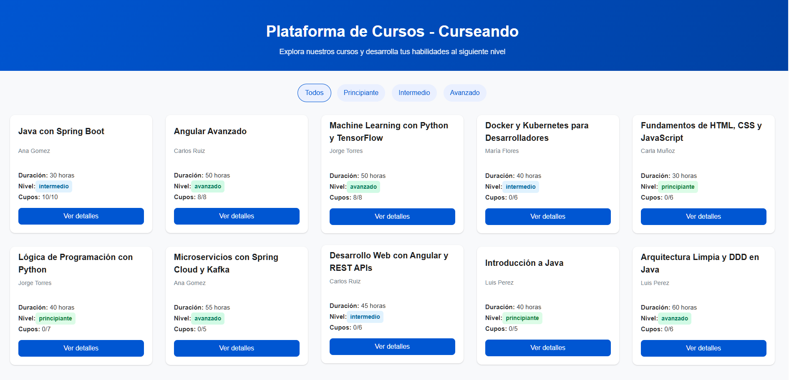
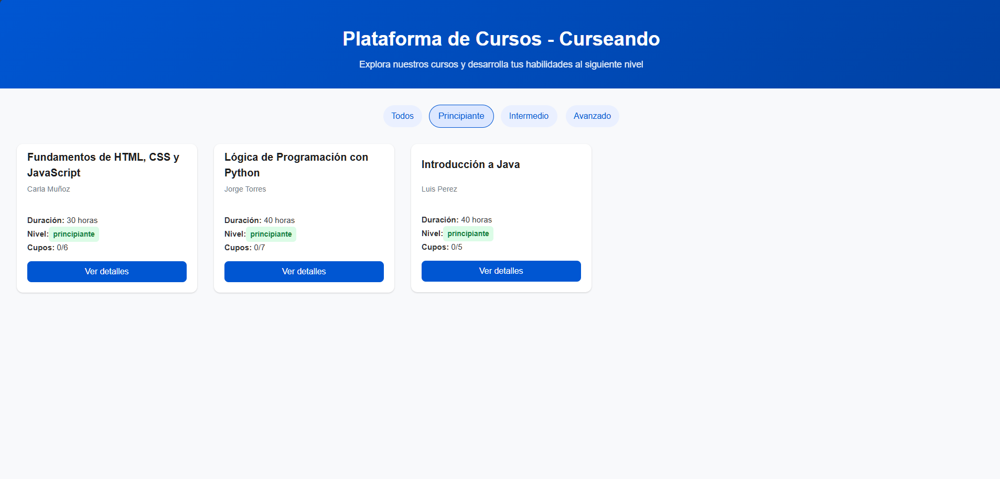
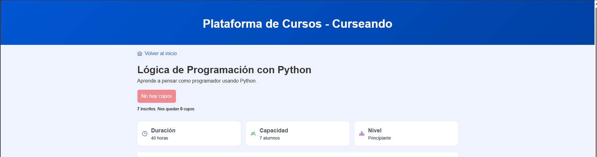
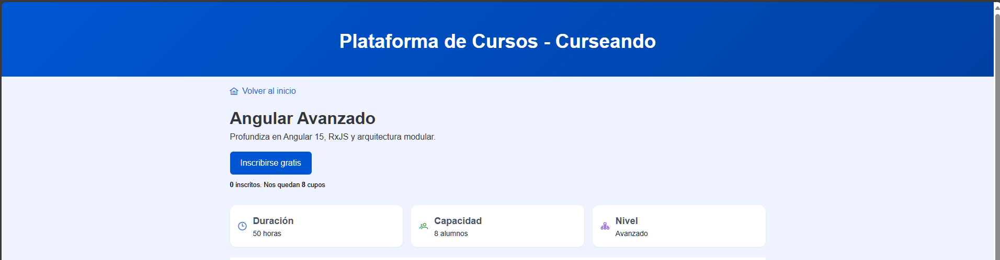
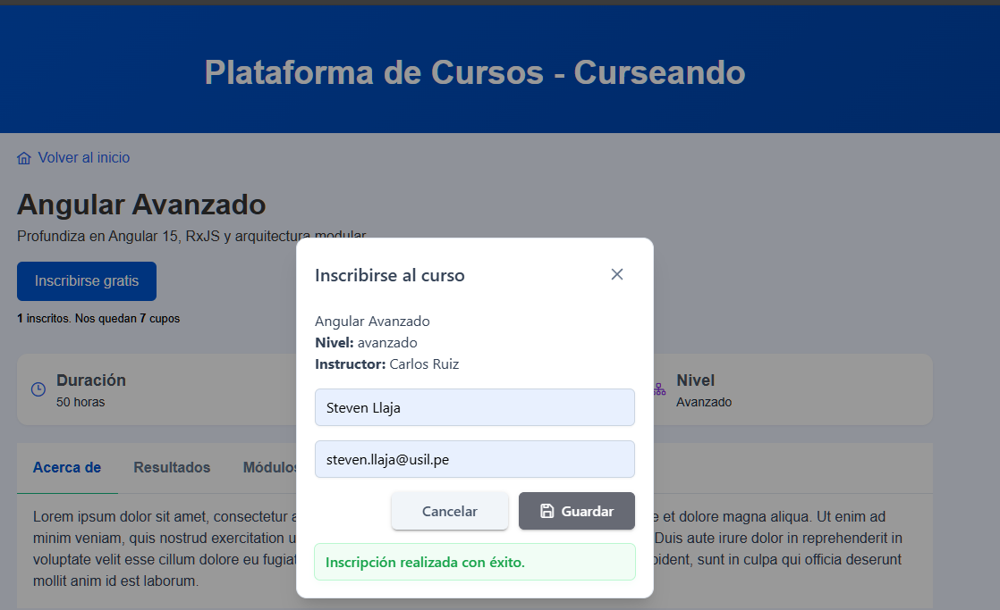

# Curseando - Frontend

Interfaz web desarrollada con **Angular 19**, **TypeScript**, y **PrimeNG**.  
Permite visualizar cursos, filtrar por niveles e inscribirse.

## Requisitos previos

- **Node.js 20+**
- **Angular CLI 19+**
- **PrimeNG 19+**
- **TailwindCSS 3+**
- **NPM 10+**

## Configuración inicial

1. Clona el repositorio:
```bash
git clone https://github.com/Steven77dev/innova-curseando-frontend.git
cd innova-curseando-frontend
```
2. Instalar dependencias:
```bash
npm install
```
3. Configurar la URL del backend en `environment.ts`.
```typescript
export const environment = {
  production: false,
  apiUrl: 'http://localhost:8080/api'
};
```
4. Ejecutar con el siguiente comando
```bash
npm start
```
App en: `http://localhost:4200`

## Capturas de pantallas

1. Listado de cursos


2. Filtrado de cursos por nivel


3. Detalle del curso (sin cupos)


4. Detalle del curso (con cupos disponibles)


5. Inscripción con éxito



## 👨‍💻 Autor
**Steven Llaja**  
Desarrollador Full Stack
📧 steven77dev@gmail.com
